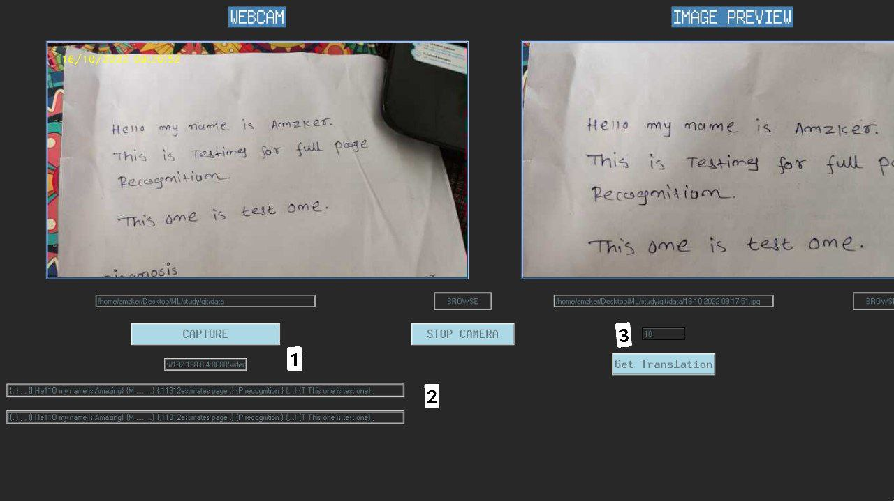

# Full-Page-Handwriting-Recognition-GUI

### Credits 
```
I used lot of people code as copy paste.
model = line by line 
Model Trained Via: https://github.com/githubharald/SimpleHTR
```
## User GUIDE:
### Install

```
git clone https://github.com/amzker/Full-Page-Handwriting-Recognition-GUI.git
cd Full-Page-Handwriting-Recognition-GUI/
pip3 install -r requirments.txt
cd model/
wget https://github.com/amzker/Full-Page-Handwriting-Recognition-GUI/releases/download/model/model.zip
unzip model.zip 
cd ../src/
```

```
model is trained on line by line method because my pc can't handle to train on full page also google colab wasn't 
usefull much,so we will be cutting image into lines and providing it into model. 
inaccuracy may arise if cutted line have chipped charectors 
```

### How To Use
1. python3 camera.py
2. You will see screen like this 
 
 ```
 where:
      1 = webcam url or number like 0 [default is 0].
      2 = Here is where your translated text will come 
      3 = Row no means in how many rows you want to divide your page to give full page input as line by line to model. use 1 for full page (if full page have only 1 line)
```
3. in 1 add your desired camera number or ip (as given in screenshot)
4. hit stop camera and start camera again to load your input camera
5. click on capture and it will be sent to image preview panel from where you can press get translation button to get direct translation and you can also select your desired image from 2nd browse button
 
## TODO:
1. Making proper GUI.
2. full page or paragraph by paragraph model training.
3. pdf to text and batch images at once.
4. CUSTOM ROW selector. -> idea is that it on image there will be resizable horizontal grids (=rowno). which user can drag adn resize to get text into line and it will be cropped adn given to model as lines if TODO[2] is not possible 
5. convert temp code to proper code and with pep8 formatting.
6. Making Android App template.
