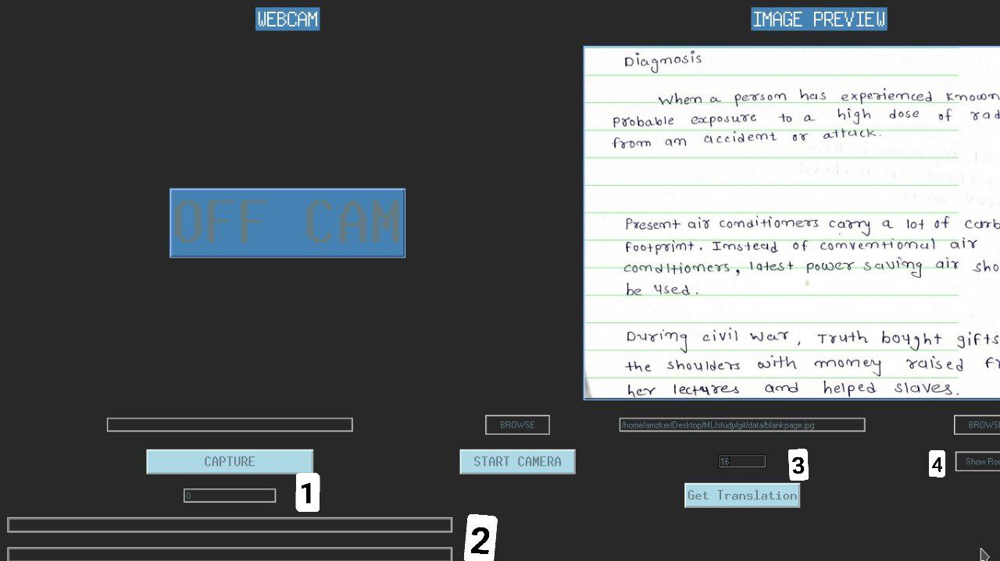

# Full-Page-Handwriting-Recognition-GUI

### Credits 
```
I used lot of people code as copy paste.
model = line by line 
Model Trained Via: https://github.com/githubharald/SimpleHTR
```
## User GUIDE:
### Install

```
git clone https://github.com/amzker/Full-Page-Handwriting-Recognition-GUI.git
cd Full-Page-Handwriting-Recognition-GUI
pip3 install -r requirments.txt
```
NOTE: Model is Already added here in ./model dir.

### How To Use
1. python3 camera.py
2. You will see screen like this 
 
 ```where:
      1 = webcam url or number like 0 [default is 0].
      2 = Here is where your translated text will come 
      3 = Row no means in how many rows you want to divide your page to give full page input as line by line to model. use 1 for full page (if full page have only 1 line)
```
3. 
